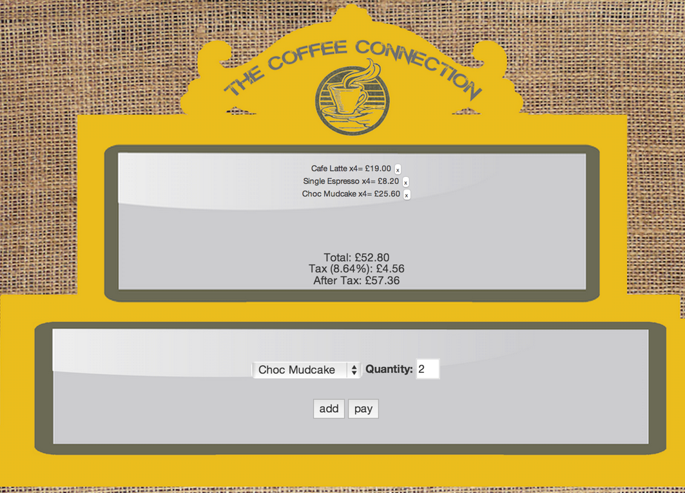

# till_tech_test
Practice Tech Test for Jobz

Heroku
---
[coffee]:https://thecoffeeconnection.herokuapp.com/
[coffee]

Screenshot
---
<div align="center">
        
</div>
<div align="center">
       <a href="https://codeclimate.com/github/HannahCarney/till_tech_test"></a>
</div>

Technologies used
----------
* Javascript
* JQuery
* Node
* Cucumber
* Html
* CSS
* Ajax

How to clone
----
```sh
git clone git@github.com:HannahCarney/till_tech_test.git
cd ReceiptTechTest
```
How to run feature tests with cucumber.js
----
```sh
npm install
make cucumber
```
How to run locally
----
Open browser to http://localhost:3000/

```sh
npm install
npm start
```

Me
----
I am [Hannah] from the December 2014 cohort of Makers Academy, London!
[Hannah]:https://github.com/HannahCarney
